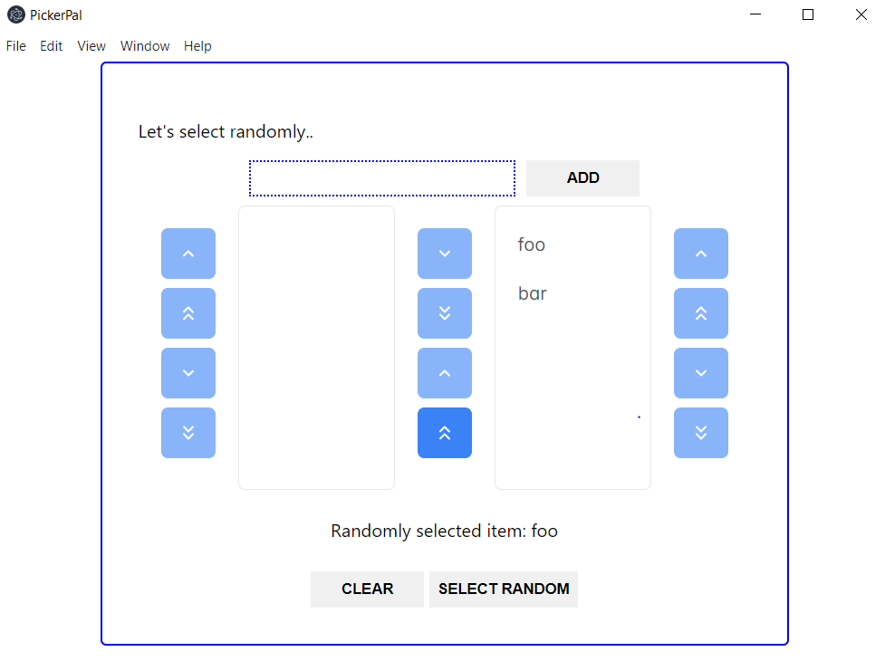

# PickerPal

## Description

PickerPal is a desktop application that helps users add a list of values and lets those values be picked randomly

## Prerequisites

- Node (version 18)

## Playing with app

1. Clone the repository.
2. Install the dependencies using the package manager of your choice.
3. Run the project using the command `npm start` or `yarn start`.

## Screenshots

